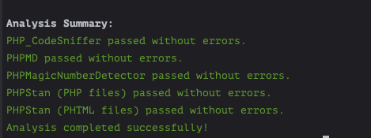

# OAuth Security Plus for Magento 2


A powerful module that **whitelists IP addresses** for Magento 2 REST and SOAP Admin API token generation. Helps prevent unauthorized API access by ensuring only requests from trusted IPs can create admin tokens.

---

## 🚫 Why Attackers Try to Steal the Admin Token (OAuth Access Token)

A stolen Admin OAuth Token gives attackers full control over your store, posing serious security risks:

1. **Order and Customer Data Theft**
    - Attackers can extract orders and customer data (emails, phone numbers, addresses).
    - Exposing personal data can lead to GDPR, CCPA, or other compliance violations.

2. **Fraudulent Order Manipulation**
    - Malicious actors may modify product prices or create fake discount rules.
    - They can also manipulate stock levels to disrupt product availability.

3. **Malicious Code Injection**
    - Attackers can use API access to inject malware or redirect customers to malicious sites.
    - This can jeopardize website integrity and user trust.

4. **Data Deletion or Ransomware**
    - They might delete all products, orders, or customer accounts.
    - Potentially demand ransom payments to restore lost data.

5. **DDoS or API Abuse**
    - Repeated API requests can slow down or crash your server, leading to downtime and lost revenue.

**In short, securing your API tokens is essential to protecting both your customers and your business.**

---
## 🌟 Overview

This module intercepts OAuth Token creation requests and checks if the requesting IP is on a **whitelist**. If not, the request is blocked and logged. Key highlights:

- **Simple Whitelist Management** using CLI commands.
- **Logging** of unauthorized attempts and IP addresses.
- **Caching** for fast IP lookups.

---
## 🚀 Key Features

| Feature                    | Description                                                                    |
|----------------------------|--------------------------------------------------------------------------------|
| **OAuth IP Whitelisting**  | Intercepts admin token requests and checks if the source IP is allowed.        |
| **CLI Management**         | Quickly add or remove IPs from the whitelist using `bin/magento` commands.     |
| **Logging & Auditing**     | Logs both allowed and blocked attempts, storing username & IP for reference.   |
| **Caching for Performance** | Minimizes repeated config lookups for quick IP checks.                         |
| **Enabled/Disabled**       | Easily turn the module on or off using config.                                 |

---

## 🛠 Installation

### **Install via Composer**
The recommended way to install this module is via **Composer**.

```bash
composer require hawksama/module-oauth-security-plus
```
---
## ⚙️ CLI Usage

```bash
Usage:
 hawksama:api-whitelist:add [ip1] [ip2] [ip3] ...
 hawksama:api-whitelist:remove [ip1] [ip2] [ip3] ...

Arguments:
 ip1-ipN        One or more IPv4 or IPv6 addresses to be added or removed
```

Example commands:
```bash
# 1) Add 203.0.113.10 and 198.51.100.25 to the whitelist
bin/magento hawksama:api-whitelist:add 203.0.113.10 198.51.100.25

# 2) Remove 203.0.113.10 and 198.51.100.25 from the whitelist
bin/magento hawksama:api-whitelist:remove 203.0.113.10 198.51.100.25

# 3) Remove ALL IPs from the whitelist 
# (no additional arguments provided)
bin/magento hawksama:api-whitelist:remove
```

---
## 🛠 Use Cases

### 🔒 Production Security
- **Restrict OAuth (API) Token Generation**: Only whitelisted IPs can generate admin tokens.

### 🏗️ Development & Staging
- **Block Public Access**: Keep staging credentials safe from the public internet.

### 🕵️ Auditing & Analytics
- **Track Attempts**: Log who’s creating tokens, from where, and how often.

---
## ❓ FAQ

1. **Does it block the entire Admin login?**
    - No, only blocks admin OAuth (API) token creation. The web-based Admin UI remains unaffected.
2. **How do I add IPv6 addresses?**
    - IPv6 is supported as long as you pass the proper string format. For advanced subnet rules, consider extending the plugin.
3. **Where is the log file stored?**
    - By default, unauthorized attempts are logged in `var/log/api_security_plus.log`.

---
## 🧰 Technical Details

- **Compatibility**: Magento 2.4.x
- **Code Quality**:  
  ✅ PHPStan (Level 8)  
  ✅ PHPMD  
  ✅ PHP_CodeSniffer (Magento Coding Standard)  
  ✅ PHP Magic Number Detector

  
- **Caching**: IP addresses are cached for faster lookups, cleared when new IPs are added or removed.
- **Technology**: Uses a plugin on `AdminTokenServiceInterface::createAdminAccessToken`

- **Extendable**: You can augment or replace the plugin logic if you need more complex checks.

---
## 📮 Support & Contribution

- **Issues**: [GitHub Issues](https://github.com/Hawksama/OauthSecurityPlus/issues) (if available)
- **Email**: manue971@icloud.com
- **Contributions**: Pull requests welcome! Please follow Magento & PSR standards.

---

> **Protect your Magento 2 store by limiting OAuth Admin Token generation to trusted IPs—simple, fast, and secure.**

